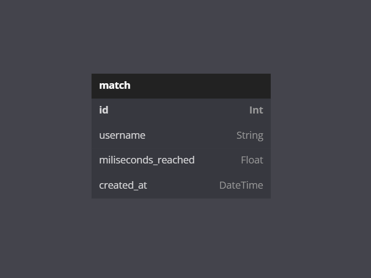

<h1 align="center">
  Anime Runner's API
</h1>

<p align="center">
  <a href="#" target="blank">
    
  </a>
</p>

<p align="center">
  Simple application in NestJS to record your longest time alive in a match at Anime Runner's.
</p>

## About The Project
Em complemento ao jogo Anime Runner's, feito na Unreal Engine 4.27, que é um jogo onde o objetivo é sobreviver o maior tempo possível, veio a ideia de registrar esse tempo de cada jogador e salvar em um banco de dados, assim sendo possível fazer um ranking de cada um.


## Built With
- [Node v19.3.0][node]
- [Typescript v4.7.4][typescript]
- [NestJS v9.0.0][nestjs]
- [Prisma v4.8.0][prisma]

## Getting Started
For the use of the project, some prerequisites will be necessary.

### Prerequisites
* Node.JS
  1. You can download here: [Node.JS][nodejs_url]
  2. Here is a step-by-step installation tutorial. [(Windows)][nodejs_tutorial_windows] [(Linux)][nodejs_tutorial_linux]

### .env variables
> You need to create an .env file inside the project root. You can also create `.env.development` and `.env.production`.

```toml
API_KEY="key"
SWAGGER="TRUE"
```

### Installation

1. Clone the repository
   ```sh
   git clone https://github.com/Arekushi/anime-runners-api.git
   ```
2. Install NPM packages
    ```sh
    npm install
    ```
3. Run in terminal
   ```sh
   npm run build
   ```
3. Start application
    ```sh
    npm run start:prod
    ```
5. All ready, the application is already running 🎉

## Roadmap
- [x] Creating models in Prisma
- [x] Ranking Module
  - [x] Matches Service
  - [x] Matches Controller
- [ ]  Test

## Schema
> You can see the generated schema below. Generated by [dbdiagram.io platform][schema]

<div align="center">
  
</div>

## Acknowledgments
* [Add header API key auth to your NestJS REST API](https://www.stewright.me/2021/03/add-header-api-key-to-nestjs-rest-api/)
* [How To Implement Passport.js in Nest.js: An Easy Tutorial](https://ownid.com/blog/how-to-implement-passport-js-in-nest-js-an-easy-tutorial/)
* [Nest.js — Authenticate with both API Key and JWT](https://medium.com/@alpercitak/nest-js-authenticate-with-both-api-key-and-jwt-4a22bf7b3049)


## Contributors
| [<div><br><sub>Alexandre Ferreira de Lima</sub></div>][arekushi] <div title="Code">💻</div> |
| :---: |

<!-- [Build With] -->
[nestjs]: https://nestjs.com/
[prisma]: https://www.prisma.io/
[node]: https://nodejs.org/dist/latest-v19.x/docs/api/
[typescript]: https://www.typescriptlang.org/

<!-- [Some links] -->
[schema]: https://dbdiagram.io/d/63ae85307d39e42284e828b0

[nodejs_url]: https://nodejs.org/en/download/
[nodejs_tutorial_windows]: https://www.edureka.co/blog/node-js-installation/
[nodejs_tutorial_linux]: https://www.geeksforgeeks.org/installation-of-node-js-on-linux/

<!-- [Constributors] -->
[arekushi]: https://github.com/Arekushi
